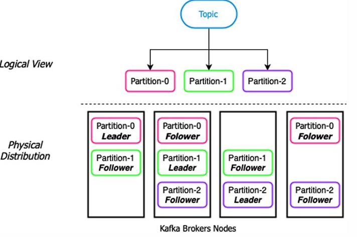
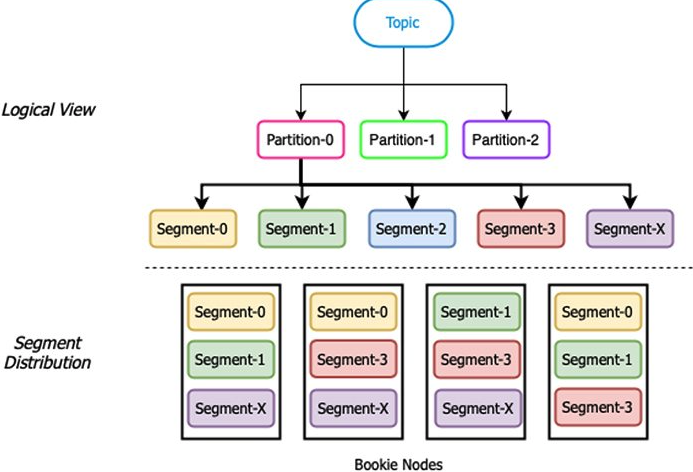
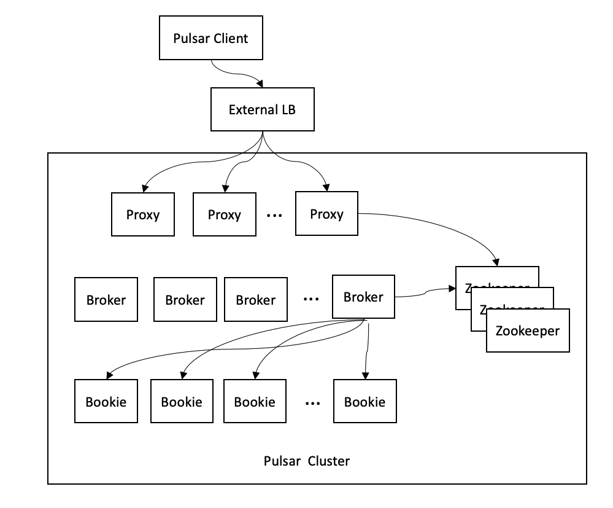
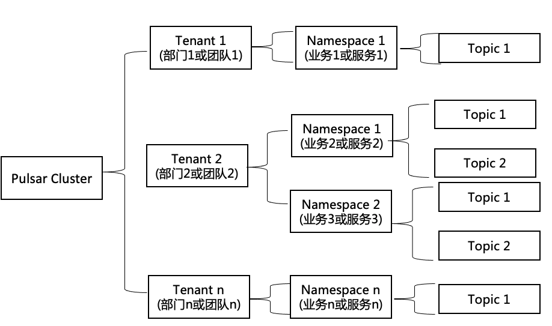

# test-pulsar
> test pulsar

## reference

- example

  - [Apache Pulsar学习笔记01: Pulsar简介](https://blog.frognew.com/2021/10/learning-apache-pulsar-01.html)

  - [Apache Pulsar学习笔记02: 初步了解Pulsar的架构，单个Pulsar集群的组成](https://blog.frognew.com/2021/10/learning-apache-pulsar-02.html)

  - [Apache Pulsar学习笔记03: 本地开发环境docker容器中运行Pulsar](https://blog.frognew.com/2021/10/learning-apache-pulsar-03.html)

  - [Apache Pulsar学习笔记04: Pulsar的租户、命名空间和Topic](https://blog.frognew.com/2021/10/learning-apache-pulsar-04.html)

  - [Apache Pulsar学习笔记05: Pulsar的生产者、消费者、订阅和订阅模式](https://blog.frognew.com/2021/10/learning-apache-pulsar-05.html)

  - [Apache Pulsar学习笔记06: Pulsar的Java客户端库](https://blog.frognew.com/2021/10/learning-apache-pulsar-06.html)

  - [Apache Pulsar学习笔记07: Pulsar的Go客户端库](https://blog.frognew.com/2021/10/learning-apache-pulsar-07.html)

  - [Apache Pulsar学习笔记08: 使用Pulsar Schema管理消息数据的类型安全性](https://blog.frognew.com/2021/10/learning-apache-pulsar-08.html)

  - [Apache Pulsar学习笔记09: Pulsar的Web图形化管理工具Pulsar Manager](https://blog.frognew.com/2021/10/learning-apache-pulsar-09.html)

  - [Apache Pulsar学习笔记10: 延迟消息投递](https://blog.frognew.com/2021/11/learning-apache-pulsar-10.html)

  - [Apache Pulsar学习笔记11: 使用分区Topic](https://blog.frognew.com/2021/11/learning-apache-pulsar-11.html)

  - [Apache Pulsar学习笔记12: 开启基于JWT的身份认证](https://blog.frognew.com/2021/11/learning-apache-pulsar-12.html)

  - [Apache Pulsar学习笔记13: 授权和权限管理](https://blog.frognew.com/2021/11/learning-apache-pulsar-13.html)

## example

### Apache Pulsar学习笔记01: Pulsar简介

> 在分布式消息系统集群中分布消息数据时，有两种不同的方法: `基于分区(Partion-based)`和`基于段(Segment-based)`。
>
> 在基于分区的消息存储结构中，Topic被划分为固定数量的分区，发布到Topic中的数据均匀的分布在分区中，同时为了确保数据冗余，每个分区会被复制到不同的节点。如下例图所示，每个分区接收到的发布到Topic的消息总数的三分之一。Topic中消息的总存储量为Topic的分区数乘以每个分区的大小，如果达到这个限制，需要向集群添加更多的节点同时增加Topic的分区数量才能继续向分区中添加数据，增加分区的数量还需要执行重新平衡，这是一个十分复杂和耗时的过程。在基于分区的消息存储结构的分布式消息系统中，一般在创建Topic的时候需要预先确定分区数量，但这样做有一些缺点，因为单个分区只会存储在集群中单个集群节点上，因此单个分区的大小就受限于该节点上的硬盘空间大小，由于Topic中的数据均匀分布在所有分区中，所以如果集群节点的硬盘容量不一样的话，那么Topic的每个分区的大小将限制为最小硬盘容量的节点。当Topic达到容量限制后，唯一能做的就是增加Topic的分区数量，但这个扩容的过程包括重新平衡整个Topic，Topic中的数据将被重新分布到该Topic的所有分区中，平衡数据的过程十分消耗网络带宽和磁盘I/O。 Kafka采用的是基于分区的消息存储架构。



> **Pulsar采用的是基于段的消息存储结构。**
>
> Pulsar依赖Apache BookKeeper项目来实现消息的持久存储，BookKeeper的逻辑存储模型是基于无限流记录作为顺序日志存储的概念。从下图可以看出，在BookKeeper中，每个日志被分解成更小的数据块，称为`段(Segament)`，这些数据块又由多个日志条目组成。然后，为了实现冗余和扩展，这些段会在存储层中被称为`bookies`的多个节点上写入。可以将段放在集群节点具有足够硬盘容量的任何位置，当没有足够的空间用于存储新的段时，可以方便地添加节点并立即存储数据。基于段的存储架构的优点在于可以实现真正的水平伸缩，段可以被无限创建并存储在任何位置。



### Apache Pulsar学习笔记02: 初步了解Pulsar的架构，单个Pulsar集群的组成

> Pulsar提供了一个比`Pulsar Cluster(Pulsar集群)`更高级别的抽象，叫`Pulsar Instance(Pulsar实例)`。一个Pulsar Instance由多个Pulsar Cluster组成，一个Pulsar实例中的集群之间可以相互跨地域复制数据。
>
> 单个的Pulsar集群由以下几部分组成:
>
> - Pulsar Proxy: 即Pulsar代理，一个集群可以有一个或多个Pulsar代理，Pulsar代理是`无状态`的，Proxy作为集群的`智能路由层`，是负责Pulsar客户端与Pulsar集群交互的统一网关。
> - Pulsar Brokers: 一个集群有多个Broker，Broker也是`无状态`的，Broker作为集群的`服务层`，Pulsar代理会将客户端的访问请求转发到正确的Broker上。Broker作为服务层与Pulsar的存储层进行交互，负责处理和负载均衡Producer客户端发出的消息，并将这些消息分派给Consumer客户端。
> - Bookies: 一个集群有多个Bookie节点(BookKeeper节点组成Bookeeper集群)负责消息的持久化存储。
> - Zookeeper集群: 用于集群级别的配置和协调，Zookeeper中存储Pulsar集群的所有元数据(例如Topic元数据、Schema、Broker负载数据等等)



### Apache Pulsar学习笔记03: 本地开发环境docker容器中运行Pulsar

#### 以docker容器运行单机Pulsar

> Pulsar 需要使用两个端口：
>
> - bootstrap service port，默认为 `8080`，Pulsar的Web接口在8080端口上。
> - broker port，默认为 `6650`，Pulsar的客户端使用这个端口来从Pulsar发送和接收数据。

```bash
docker pull apachepulsar/pulsar:2.8.1

docker volume create pulsar-data
docker volume create pulsar-conf

docker run -d -p 6650:6650  -p 8080:8080 --privileged \
-v pulsar-data:/pulsar/data -v pulsar-conf:/pulsar/conf \
--name pulsar \
apachepulsar/pulsar:2.8.1 bin/pulsar standalone
```

#### 命令行工具pulsar-admin

> 1. 使用`pulsar-admin`可以从一个点管理整个实例，包括所有集群。
> 2. pulsar在逻辑架构上由租户(Tenant)、命名空间(Namespace)、主题(Topic)组成。结构是：`persistent://tenant/namespace/topic`。

```bash
# 进入容器
docker exec -it pulsar /bin/bash
cd /pulsar/bin

# 查看集群
./pulsar-admin clusters list
# 查看租户
./pulsar-admin tenants list

# 创建租户 study
./pulsar-admin tenants create study
# 在租户 study 下创建 namespace app1
./pulsar-admin namespaces create study/app1
# 在 study/app1 下创建 topic topic-1
./pulsar-admin topics create persistent://study/app1/topic-1
```

### Apache Pulsar学习笔记04: Pulsar的租户、命名空间和Topic

> Pulsar被设计为一个多租户系统，租户可以跨集群分布，每个租户都可以有单独的认证和授权机制，可以针对租户设置存储配额、消息生存时间TTL和隔离策略。



#### 租户

> 租户可以跨集群分布，表了组织中特定的业务单元，产品线、核心功能，这些由组织不同的部门或团队负责。

#### 命名空间(Namespace)

>命名空间是租户的管理单元，每个租户下可以创建多个命名空间。可以通过在命名空间上设置的配置策略来管理该命名空间下的Topic，这样就可以在命名空间的级别上为该命名空间的所有Topic设置访问权限、调整复制设置、管理跨集群跨地域的消息复制，控制消息过期时间。

#### 主题(Topic)和分区主题(Partitioned Topic)

>在Pulsar中所有消息的读取和写入都是和Topic进行，Pulsar的Topic本身并不区分`发布订阅模式`或者`生产消费模式(独占, 一个消息只能被一个消费者消费)`，Pulsar是依赖于各种`订阅类型`来控制消息的使用模式。

> Pulsar 支持分区主题（partitioned topic），内部将分区分为多个内部topic这样就可以多台broker提供服务，并且在用户无感知的情况下扩容分区了。

#### Topic的URL，持久化Topic和非持久化Topic

> pulsar 支持持久化topic和非持久化topic，他们的url分别为：
>
> - persistent://tenant/namespace/topic-name
> - non-persistent://tenant/namespace/topic-name

### Apache Pulsar学习笔记05: Pulsar的生产者、消费者、订阅和订阅模式

> 四个核心概念：
>
> - producer：Producer是一个连接到Pulsar Broker(或Pulsar Proxy)上的进程，Producer发送消息到Topic。
> - consumer：Consumer也是一个连接到Pulsar Broker(或Pulsar Proxy)上的进程，是从Broker接收消息的进程，Consumer成功处理了一条消息后需要向Broker发送确认(ACK)，以让Broker知道消息已经被接收和处理，如果Broker在预先设置的时间范围内没有收到确认(ACK)， Broker可以将消息重新发送订阅该Topic的Consumer。
> - Subscription-name：类似于 kafka 的 consumer group，但是可以配合 `Subscription-type` 来实现一些比较复杂的功能
> - Subscription-type：订阅类型

#### 订阅和订阅模式

>Pulsar支持4种订阅模式:
>
>- exclusive(独占模式)
>- failover(故障转移模式，也叫灾备模式)
>- shared(共享模式)
>- key-shared(基于key的共享模式)

#####  exclusive(独占模式)

> 独占模式，只能有一个Consumer绑定到订阅上。如果多于一个Consumer尝试以使用相同的订阅订阅Topic，就会抛出异常且无法连接。


#####  failover(灾备模式)

> 可以启动多个 consumer，但是只有一个 consumer 会消费数据，其他的 consumer 都是某一个 consumer 的备份。


##### shared(共享模式)

> 多个消费者任务并行的消费pulsar，每条消息只会被一个消费者任务消费到。
>
> 1. 无法保证数据顺序消费；
> 2. 不可使用 cumulative ack


#####  key-shared(基于key的共享模式)

> `key-shared` 是 `shared` 模式的一个特例，对于相同的 `key` 的消息会被分配给一个消费者实例。

####  使用pulsar-client

```bash
# 创建 topic
pulsar-admin topics create persistent://study/app1/topic-1

# 查看topic
pulsar-admin topics list study/app1
```

> 使用 `pulsar-client` 启动一个消费者，消费者名为 `sub-1`，消费类型为 `Exclusive`

```bash
./pulsar-client consume \
persistent://study/app1/topic-1 \
--num-messages 0 \
--subscription-name sub-1 \
--subscription-type Exclusive
```

> 发送消息

```bash
./pulsar-client produce persistent://study/app1/topic-1 --num-produce 2 --messages "helloworld"
```


